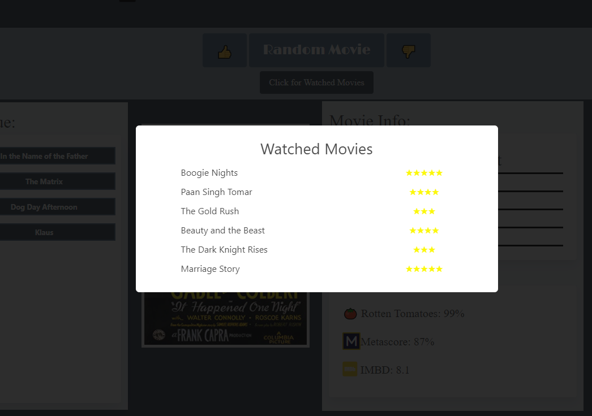

# Movie Generator

## Summary

- An app that displays random movies in detail for user to add to a watch later queue.

## Features

- Create and update a list of movies to watch.
- Track watch progress along with personal rating for each movie in the watched list.
- Find movies in list of movies to be watched (based on user preferences):
  - Genre(s): Action, Comedy, Drama, Fantasy, etc.
  - Rating(s): G, PG, PG-13, etc.
  -Text Search
- Displays movie posters, scores, plots, and much more!
- User created "to watch" and "watched" lists 

## Tech Used
  - HTML, CSS, Javascript
  - Bulma CSS Framework
  - jQuery
  - Random Movie API developed by Ketuman Vishwakarma: https://github.com/k2maan
  - Movie details provided by Open Movie Database.

## Screenshots

## Link

Try the [**Movie Generator**](https://amplifyrebel.github.io/movie-generator/) app

## Demo

Click [**here**](https://youtu.be/__Xxidc2sFY) to view a walkthrough/demo on YouTube

## Team

Ethan Johnson - Project Manager, HTML, CSS, Debugging (add_email)
Sarah Turner - HTML, CSS, Debugging (add_email)
Jackson Williams - Javascript, APIs (add_email)
Joe Christianson - Javascript, APIs - joechristiansonwebdev@gmail.com

